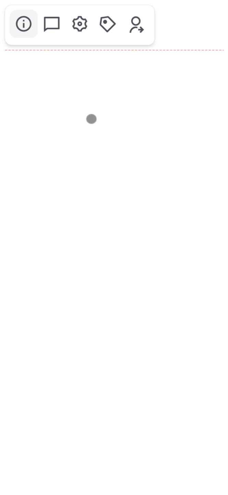
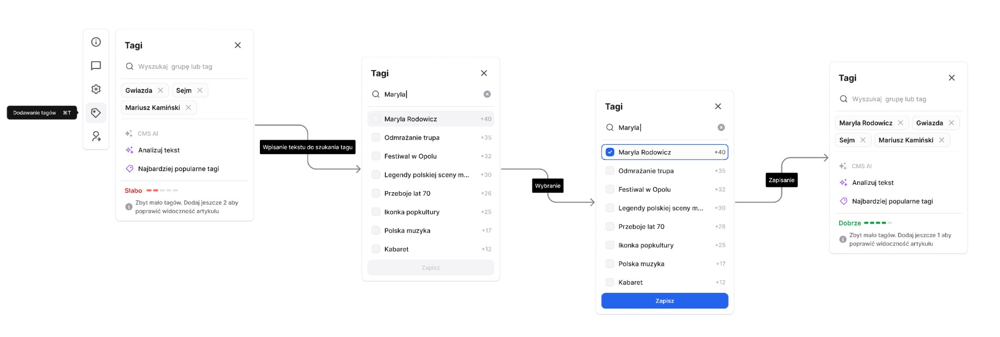

# React.js CMS component

React.js CMS component written using React.js, TypeScript, Tailwind CSS.

Used technlogies:

- React.js
- TypeScript
- Tailwind CSS

There are clickable all of 5 sidebar modals. 4 of them are filled with sample texts but all of them has clickable elements like close icon.

The full function of the task is included in the `SidebarTagsModal.tsx` component.

You can use the search input to find the tags you are interested in by typing a particular letter, these tags will be displayed according to the characters you type, after selecting the tags. You click the save button to save the tags, then you will get the information depending on the number of selected tags.

The component has been styled using Tailwind CSS while maintaining RWD principles, so it displays well on desktop as well as mobile devices.

Sample tags were created in the json file located in `/src/data/tags.json`. You can see all of them below:

```json
[
  { "id": 1, "name": "Gwiazda", "checked": false },
  { "id": 2, "name": "Sejm", "checked": false },
  { "id": 3, "name": "Jarosław Kaczyński", "checked": false },
  { "id": 4, "name": "PiS", "checked": false },
  { "id": 5, "name": "Wybory", "checked": false },
  { "id": 6, "name": "Wakacje", "checked": false },
  { "id": 7, "name": "Majówka", "checked": false },
  { "id": 8, "name": "PO", "checked": false },
  { "id": 9, "name": "Wyjazd", "checked": false },
  { "id": 10, "name": "Kodowanie", "checked": false },
  { "id": 11, "name": "Wybory prezydenckie", "checked": false },
  { "id": 12, "name": "Wybory parlamentarne", "checked": false }
]
```

Let's move on to discuss the main functionality.
The `<SidebarTagsModal />` has been divided into 3 minor components that make up the full functionality.

- `<SidebarTagsModal />` - modal creates a main structure containing a modal template with a title and a hook to hide the modal & include main tag component named TagsComponent
- `<TagsComponent />` - component contains the other 2 components:

  - `<TagsOptions />` - the component responsible for 3 functions such as: CMS AI (currently unavailable), text analysis & the most popular tags
  - `<TagsQuality />` - component, which is used to evaluate the number of selected tags according to a 5-degree scale.

## How to run locally?

Make sure you are in the project folder `react-cms-component`, if no then go into the project folder

```bash
cd './react-cms-component'
```

Type:

```bash
npm i
npm run dev
```

and open

```bash
http://localhost:5173/
```

## Live link

https://goldipl.github.io/react-cms-component/

## Project preview in `.gif` file - desktop version


## Project preview in `.gif` file - mobile version



### Target functionality to be achieved:



## Configuration info - Expanding the ESLint configuration

If you are developing a production application, we recommend updating the configuration to enable type aware lint rules:

- Configure the top-level `parserOptions` property like this:

```js
export default {
  // other rules...
  parserOptions: {
    ecmaVersion: "latest",
    sourceType: "module",
    project: ["./tsconfig.json", "./tsconfig.node.json"],
    tsconfigRootDir: __dirname,
  },
};
```

- Replace `plugin:@typescript-eslint/recommended` to `plugin:@typescript-eslint/recommended-type-checked` or `plugin:@typescript-eslint/strict-type-checked`
- Optionally add `plugin:@typescript-eslint/stylistic-type-checked`
- Install [eslint-plugin-react](https://github.com/jsx-eslint/eslint-plugin-react) and add `plugin:react/recommended` & `plugin:react/jsx-runtime` to the `extends` list
